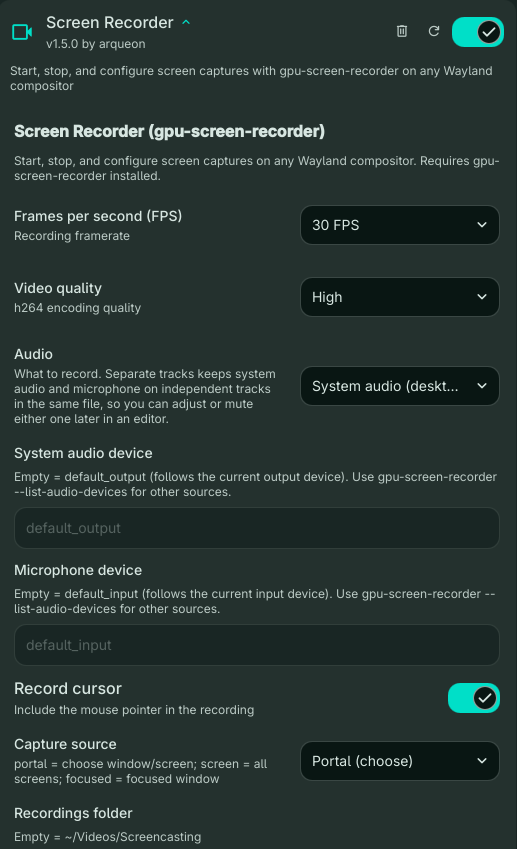

# Screen Recorder — Dank Material Shell Plugin

Plugin for **Dank Material Shell (DMS)** that wraps `gpu-screen-recorder` in a QML UI, letting you start, pause, and stop screen recordings directly from the DankBar. Works on any Wayland compositor.



## What's new in v1.5.0

- **Audio modes**: record system audio, microphone, both mixed into one track, both as **separate tracks** in the same file (ideal for tutorials — adjust or mute either track later in an editor), or no audio.
- **Quick switching**: scroll the mouse wheel over the bar pill (while idle) to cycle audio modes, or bind `cycleAudioMode` / `setAudioMode <mode>` IPC commands to keyboard shortcuts. The pill shows the active mode next to the camera icon.
- **Device overrides**: pick a specific monitor or microphone; empty defaults (`default_output` / `default_input`) follow the active devices, even if you switch outputs mid-recording.
- Legacy `Record audio` / `Audio source` settings migrate automatically.

## What's new in v1.4.0

- Uses DMS's supported composite layout: an always-on daemon owns the recorder while DankBar widgets share its state over IPC.
- Stops only the process it started. It sends `SIGINT` to finalize the video, then escalates only if that process fails to exit.
- Checks the recorder binary and portal ScreenCast interface before starting, and surfaces `gpu-screen-recorder` diagnostics when a recording fails.
- Verifies that the output video exists before reporting success or running a post-record command.
- Adds focused-window capture and an explicit audio-source setting; `default` follows the current PipeWire/PulseAudio output monitor.

## Requirements

- [Dank Material Shell](https://github.com/AvengeMedia/DankMaterialShell) >= 1.2.0
- [gpu-screen-recorder](https://git.dec05eba.com/gpu-screen-recorder/) installed and in your `PATH`
- A working XDG Desktop Portal with the ScreenCast interface (required when **Capture source** is set to `portal`)

> **Note:** The [Flatpak version of gpu-screen-recorder](https://flathub.org/en/apps/com.dec05eba.gpu_screen_recorder) is a bundled GUI frontend and is **not supported**. Install the native system package instead.

### Installing gpu-screen-recorder

#### Arch Linux & derivatives
```bash
sudo pacman -S gpu-screen-recorder
```

#### Other distros
See the [official installation guide](https://git.dec05eba.com/gpu-screen-recorder/about).

### XDG Desktop Portal (for portal capture mode)

If portal capture is unavailable, make sure the backend appropriate to your compositor is installed and active. The plugin checks for the `org.freedesktop.portal.ScreenCast` interface before opening the selector.

```bash
# Inspect the active portal backend
systemctl --user status xdg-desktop-portal
gdbus introspect --session \
  --dest org.freedesktop.portal.Desktop \
  --object-path /org/freedesktop/portal/desktop
```

If the ScreenCast interface is missing, install/configure the portal backend for your desktop or compositor, then restart the portal user services.

## Installation

```bash
# Clone
git clone https://github.com/arqueon/dms-screen-recorder
ln -sf "$(pwd)/dms-screen-recorder" ~/.config/DankMaterialShell/plugins/screenRecorder

# Reload
dms ipc plugin-scan reload screenRecorder
```

Then go to **DMS Settings → Plugins** and enable the plugin on the bar. On current DMS versions, rescan/reload it with:

```bash
dms ipc plugin-scan rescan screenRecorder
dms ipc plugin-scan reload screenRecorder
```

## Usage

### DankBar controls

| Action | Result |
|--------|--------|
| Left click | Start recording |
| Left click (while recording) | Show **Stop?** confirmation — click again to stop and save |
| Right click or Middle click | Pause / Resume |
| Scroll wheel (while idle) | Cycle audio mode (no audio → system → mic → mixed → separate tracks) |

When you click to stop, the pill turns orange and shows **Stop?** for 3 seconds. Click again to confirm, or do nothing to cancel and keep recording. This prevents accidentally stopping a recording with a misclick.

### IPC commands (keybinds)

The plugin exposes IPC commands you can bind to keyboard shortcuts:

```bash
dms ipc call screenRecorder toggleRecording   # start or stop
dms ipc call screenRecorder startRecording
dms ipc call screenRecorder stopRecording
dms ipc call screenRecorder togglePause       # pause or resume
dms ipc call screenRecorder cycleAudioMode    # next audio mode
dms ipc call screenRecorder setAudioMode both_tracks   # none|system|mic|both_merged|both_tracks
dms ipc call screenRecorder getAudioMode
```

Audio mode changes while recording apply to the **next** recording.

> **Note:** IPC commands bypass the 3-second stop confirmation. `toggleRecording` stops immediately when a recording is active.

**niri** (`~/.config/niri/config.kdl`):
```kdl
bindings {
    Mod+Alt+R { spawn "dms" "ipc" "call" "screenRecorder" "toggleRecording"; }
    Mod+Alt+P { spawn "dms" "ipc" "call" "screenRecorder" "togglePause"; }
}
```

**Hyprland** (`hyprland.conf`):
```conf
bind = SUPER ALT, R, exec, dms ipc call screenRecorder toggleRecording
bind = SUPER ALT, P, exec, dms ipc call screenRecorder togglePause
```

**Sway** (`~/.config/sway/config`):
```conf
bindsym $mod+Alt+r exec dms ipc call screenRecorder toggleRecording
bindsym $mod+Alt+p exec dms ipc call screenRecorder togglePause
```

**KDE Plasma** (System Settings → Shortcuts → Custom Shortcuts):
Set the trigger command to `dms ipc call screenRecorder toggleRecording`.

**Wayfire / COSMIC / any compositor with custom keybind support:** Run `dms ipc call screenRecorder <method>` as the command.

## Configuration

Open **DMS Settings → Plugins → Screen Recorder**:

| Option | Description | Default |
|--------|-------------|---------|
| **Frames per second** | Recording framerate | 60 |
| **Video quality** | h264 encoding preset | Very high |
| **Audio** | What to record: no audio, system audio, microphone, both mixed, or both as separate tracks | System audio |
| **System audio device** | Empty = `default_output` (follows the active output). Accepts an entry from `gpu-screen-recorder --list-audio-devices` | — |
| **Microphone device** | Empty = `default_input` (follows the active input). Accepts an entry from `gpu-screen-recorder --list-audio-devices` | — |
| **Record cursor** | Include mouse pointer | On |
| **Capture source** | `portal` = choose window/screen on start; `screen` = all screens; `focused` = focused window | portal |
| **Recordings folder** | Output directory (empty = `~/Videos/Screencasting`) | — |
| **Post-record command** | Command to run after recording finishes. Use `$1` to reference the file path. | — |

### Audio modes explained

- **System audio** — desktop sound only: what you hear (videos, calls, games). Use it to record a Zoom meeting or a playing video.
- **Microphone** — your voice only: narrated tutorials where desktop sound doesn't matter.
- **Both, mixed** — one audio track with everything. Smallest and simplest, but the balance is fixed forever.
- **Both, separate tracks** — the same MP4 carries two independent audio tracks (system on track 1, mic on track 2). Best for tutorials: raise, lower, or mute either track afterwards in any editor (Kdenlive, DaVinci, ffmpeg). Most players play the first track by default; editors see both.

To extract or remix tracks later:

```bash
ffprobe recording.mp4                                   # inspect tracks
ffmpeg -i recording.mp4 -map 0:a:1 -c copy mic.opus     # extract mic track
```

### Post-record command examples

| Goal | Setting value |
|------|---------------|
| Copy `file://` URI to clipboard | `wl-copy --type text/uri-list "file://$1"` |
| Open file with `dragon-drop` | `dragon-drop "$1"` |
| Open in `mpv` | `mpv "$1"` |
| Copy raw path to clipboard | `wl-copy "$1"` |
| Run a custom script | `~/.local/bin/my-script "$1"` |

The file path is available as `$1` and is fully expanded (e.g. `~/Videos/Screencasting/2026-06-13_09-00-00.mp4`).

## How stopping works

The plugin keeps ownership of its own recorder process and sends it `SIGINT`, allowing the MP4 to finalize. It waits ten seconds before a controlled `SIGTERM` fallback and only force-stops as a final fallback five seconds later. It never searches for or terminates other `gpu-screen-recorder` processes.

The “saved successfully” notification and `postRecordCommand` run only after the recorder exits successfully and the output file exists with content. Failures include the recorder's diagnostic output, which is especially useful for portal/backend problems.

## Development

```bash
ln -sf "$(pwd)" ~/.config/DankMaterialShell/plugins/screenRecorder
dms ipc plugin-scan reload screenRecorder
dms ipc plugin-scan list
```

## License

MIT
